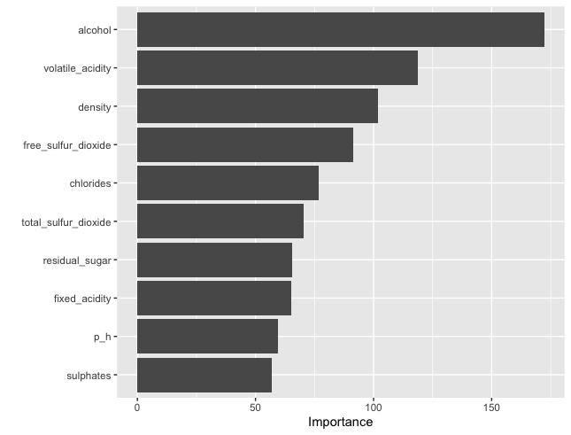

# Wine Quality Prediction

I like wine but I don’t understand it. I see no difference between a $2 Trader Joe’s bottle and any expensive French wine. I also think that wine connoisseurs are pedantic liars; wine preference is more subjective than objective in my mind. That being said, I wanted to test my hypothesis- are there key metrics that determine wine quality. Therefore, I wanted to see how likely it is to predict the quality of wine (on a 1-10 scale) based on the relationships of its variable components. I also looked at the distribution of quality within clusters to see if there's any latent structure connecting some of these variables to quality. 

For context, The data was collected in Portugal by a team of researchers that wanted to predict human wine taste preferences based on easily available analytical tests. The dataset is split between red and white “vinho verde” samples, which is Portuguese wine. This information is useful, because if there is a pattern predicted then wine tasting becomes more objective and wine could be produced to fit that criteria. Also, I can use this information to act snobbish when sipping $2 wine.

The first thing to mention is that there are many more white wine observations than red wine. I’m going to keep both wines separate because I think that it could be interesting to compare what predictors make for a good red wine as opposed to predictors that make for a good white wine. It’s evident that people are much more satisfied with white wine, as displayed in the graph below. This was just further evidence for me to keep the datasets separate because what probably works best for white wine is not true for red wine. 


Because I was surprised at the difference in distribution of quality scores for red vs. white wines, I wanted to test if there was potential bias toward white wines, or are there really just more higher quality whites than reds? I tried to test this bias by by making models for the red wine first and then testing the top models on the white wine data.

I first made some candidate models simpler candidate models:

```{r, echo=FALSE, message=FALSE, warning=FALSE}
library(tidyverse)
library(janitor)
library(modelr)
library(rsample)
library(knitr)
library(tidyselect)
library(ggplot2)

tibble(
  model_type = c("Linear", "Random Forest", "XGBoost",
                 "Ridge Logistic", 
                 "SVM - linear", 
                 "SVM - radial", 
                 "SVM - polynomial"),
  tuning = c("fmla = quantity ~ . -id", "mtry = 5",
             "eta = 0.0217, nrounds = 220", "lambda = 0.026",
             "cost = 1, fmla = quality ~ . -id",
             "cost = 5, fmla = quality ~ . -id",
             "cost = 10, fmla = quality ~ . -id"),
  misclass_rate = c(0.407, 0.341, 0.381, 0.405, 0.455, 0.388, 0.425)
) %>%
  arrange(misclass_rate) %>%
  kable()
```

As you can see, the three top models were Random Forest, Boosted, Radial SVM. The misclass rates for these models weren't terrible so I had to eat my words. There are definitely variables that can determine wine quality. For Random Forests, I used mtry as the only tuning parameter, which would tell me how many variables to use while splitting the nodes to construct bootstrapped trees. Because mtry = 5 was selected as the best parameter, I used that to fit the model again and look at variable importance.


It seems that the amount of alcohol in wine is the most important factor in determining quality (SHOCKER!). I was expecting volatile acidity, since it showed a strong correlation to quality in the initial corrplot for red wine. As for chlorides and sulfur, I was not expecting them to be as significant as they were.  This information is useful when narrowing down predictors for choosing linear regression models. 


The upward trend is quite clear. The sharpest decline happens around 10-12. It almost kind of looks like a shape of a logistic regression line, with the lowest slopes in the edgest and highest slope in the middle.

After gaining that understanding, I decided to see if there are any latent structures connecting variables to quality using clustering methods. I started by using K-means because I wanted to experiment with it. This approach works by randomly assigning labels and updating centroids, so there’s no simple numerical way to know how many k-classes are good unless you visualize the data. I tried different numbers of clusters k, and realized from the visuals below that just 2- K tend to produce more distinct clusters. This is supported by the following graph where you can see it drop off after 2.


I actually got a better result running hierarchical clustering using complete linkage as a tuning parameter- which is the maximum distance between two points. So now you can see the clusters more clearly but only some of the members in the cluster are similar. This can be seen from the plots.


There is a lot of overlap, so I used `daisy()` & `pam()`) to perform clustering and it was still quite jumbled. Therefore, I don’t see much of a pattern, which defeats the purpose of unsupervised learning. 

This wrapped up my analysis for red wine. I was able to disprove my earlier belief that the quality is objective, and I got data to prioritize certain variables like alcohol, volatile acidity, sulphates, and chlorides. These main predictors were different from what I would have guessed from just looking at the corrplot. This makes sense because most variables are correlated, so alcohol would obviously affect density, so the corrplot would show a strong correlation with that variable even though it’s not a good predictor. 

I then decided to run the top models on the white wine data to see if there were any predictors that were more important in that scenario.



While alcohol is still the most prevalent, density was more important. This suggests that wine is considered better when it’s less dense which is directly correlated to residual sugar, and means that it’s better when it’s less sweet. Also free sulfur dioxide has to do with spoilage just like volatile acidity, which suggests that spoilage is a larger concern for white wines.


Now looking at the clustering visualizations, there are also no apparent patterns for white wine. If I wanted to look more deeply on the subject, I would probably try to use neural networks but as a journalist I don't see myself going that deep into statistical learing in the future. I think just concentrating on clustering was good practice. I also think that the application of deep learning techniques using neural networks as implemented through the use of the keras and tensorflow packages is a bit excessive for what we're trying to acheive with this data.


